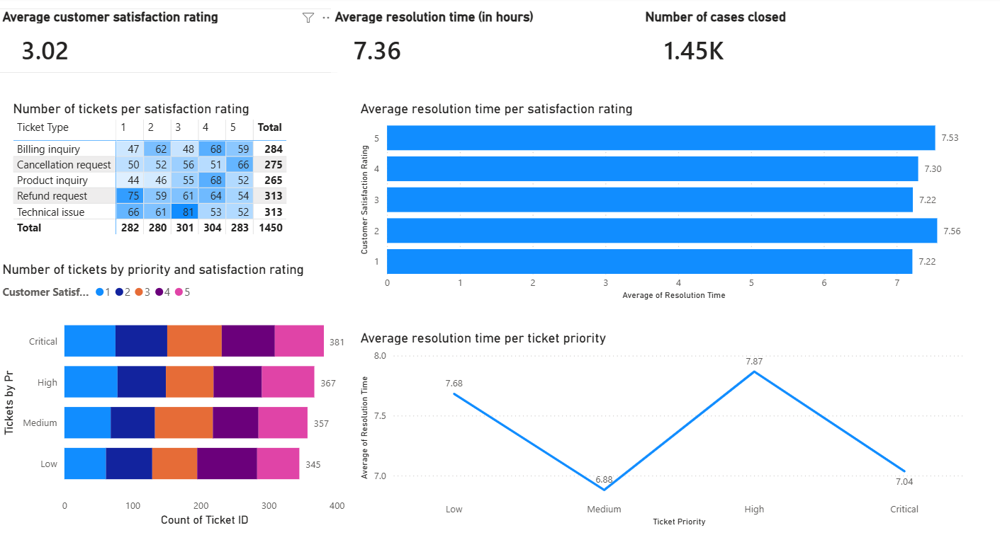

# Customer Support Ticket Data Analysis

## Project Overview
This data analysis project takes a dataset from Kaggle.com consisting of customer support tickets. Fields include satisfation rating, first response time, and time to resolv, among others. The overall goal is to study the affecting factors of customer satisfaction.

## Dashboard download
Since the dashboard was created in PowerBI Desktop, a download link will instead be provided to the .pbix file:

**[Click here to download the .pbix file](https://github.com/LanceSaluta/customer-support-cases-data-anaylsis/raw/refs/heads/main/Customer%20Support%20Ticket%20Data%20set%20analysis.pbix)**

Clicking the link will download a file which can be opened in PowerBi desktop where the dashboard can be interacted with.

## Dashboard preview
Below is a snapshot of the dashboard interface for use by stakeholders:

## Key Business Insights
- **Customer Satisfaction:** Customer satisfaction did not depend on average resolution time or ticket priority, suggesting that other factors are possibly affecting rating.
- **Ticket Priority:** Critical and high priority tickets contributed to the lowest customer satisfaction ratings in the dataset. Further, ticket priority did not affect resolution time.
- **Types of tickets and satisfaction:** Data suggests that refund requests, technical issues, and billing inquiry consisted the bulk of the low customer ratings.

## Data Methodology & Tools Used
- **Excel / Power Query:** Used for end-to-end data extraction, transformation, and structural schema validation (ETL).
- **Microsoft Power BI:** Primary data visualization tool used. Also used to further manipulate data and extract other information not present in initial data set (i.e. average resolution time).
